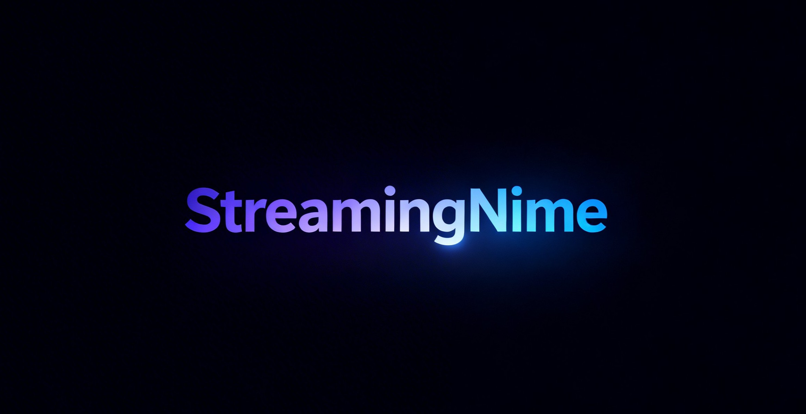

# StreamingNime - Anime Streaming Website

<p align="center">
  
</p>

StreamingNime is a fully responsive anime streaming website built using Laravel as a structural framework, featuring a modern glass morphism UI, anime listings, genre filtering, and detailed anime pages.

> ⚠️ This project is frontend-focused. Laravel is used only for routing, templating, and page structure.  
> There is no database, authentication, or backend logic implemented.

🌐 Live Website  
https://streamingnime.great-site.net/

💻 Source Code  
https://github.com/zayennn/streamingnime

---

## ✨ Features

### 🏠 Homepage
- Hero slider with autoplay anime highlights
- Trending anime section
- Ongoing anime with airing schedule
- Top rated anime collection
- Popular genres quick navigation

### 📋 Anime List Page
- Alphabet filter (A–Z, numbers, symbols)
- Quick category filters (Trending, New, Top Rated, Ongoing)
- Real-time search with debounce
- Multi-filter system (genre, type, status)
- Sorting options (title, rating, popularity, newest)
- Grid / list view toggle
- Pagination (24 items per page)

### 🎭 Genre List Page
- Gradient genre cards with anime previews
- Genre statistics
- Real-time genre search
- Sorting by name, popularity, count
- Top anime preview per genre
- Responsive adaptive grid

### 📺 Anime Detail Page
- Hero poster section with gradient overlay
- Detailed anime information
- Full synopsis
- Searchable & sortable episode list
- Progressive episode loading
- Related anime recommendations
- Action buttons (Watch, Share, Add to List UI)

### 🎨 UI / UX
- Glass morphism interface
- Dark theme design
- Gradient accent styling
- Smooth hover & transition animations
- Custom themed scrollbar
- Fully responsive layout
- Loading states & skeleton UI
- Friendly empty states
- Parallax scrolling effects using Paroller.js

---

## 🛠️ Tech Stack

### Framework & Structure
- Laravel 10 — routing, Blade templating, page structure (frontend usage only)

### Frontend
- HTML5
- CSS3 (fully custom, no frameworks)
- Vanilla JavaScript
- Swiper.js (sliders & transitions)
- Paroller.js (parallax scrolling effects)

### CSS Techniques
- CSS Grid & Flexbox
- CSS Variables
- CSS Animations & Keyframes
- Responsive media queries
- Backdrop filter (glass effect)
- Custom scrollbar styling
- Gradient text effects

---

## 📁 Project Structure

```
streamingnime/
├── app/
│   ├── Http/
│   │   └── Controllers/
│   │       └── HomeController.php
│   └── Data/
│       └── animeData.php
├── resources/
│   ├── views/
│   │   ├── layouts/
│   │   │   └── home/
│   │   │       └── app.blade.php
│   │   ├── components/
│   │   │   └── home/
│   │   │       ├── navbar.blade.php
│   │   │       └── footer.blade.php
│   │   ├── welcome.blade.php
│   │   ├── anime-list.blade.php
│   │   ├── genre-list.blade.php
│   │   ├── genre-detail.blade.php
│   │   └── anime-detail.blade.php
├── public/
│   └── home/
│       ├── css/
│       │   ├── app.css
│       │   ├── navbar.css
│       │   ├── footer.css
│       │   ├── styles.css
│       │   ├── anime-list.css
│       │   ├── genre-list.css
│       │   └── anime-detail.css
│       └── js/
│           ├── app.js
│           └── anime-list.js
└── routes/
    └── web.php
```

---

## 🚀 Installation

### Requirements
- PHP ≥ 8.1
- Composer

### Steps

Clone repository

```
git clone https://github.com/zayennn/streamingnime.git
cd streamingnime
```

Install dependencies

```
composer install
```

Environment setup

```
cp .env.example .env
php artisan key:generate
```

Run development server

```
php artisan serve
```

Open browser

```
http://localhost:8000
```

---

## 📊 Data Structure

All anime content is stored as static dummy data.

Location:

```
app/Data/animeData.php
```

Example structure:

```php
[
    'id' => 1,
    'title' => 'Anime Title',
    'letter' => 'A',
    'year' => 2024,
    'rating' => 8.5,
    'episodes' => '24',
    'episode' => 'S1 E12',
    'type' => 'TV',
    'status' => 'airing',
    'genres' => ['Action', 'Adventure'],
    'image' => 'images/anime/title.jpg',
    'badge' => 'Hot',
    'airing' => 'Airing Now',
    'time' => 'Sundays',
    'score' => 8.5,
    'rank' => 1,
    'description' => 'Anime description...',
    'studio' => 'Studio Name',
    'duration' => '24 min per episode',
    'aired' => 'Jan 2024 to Mar 2024'
]
```

---

## 📱 Responsive Design

Optimized for:

- Mobile (320px+)
- Tablet (577px+)
- Laptop (769px+)
- Desktop (993px+)
- Large screens (1200px+)

---

## 🎨 Color Scheme

Primary Colors
- Pink: #ff006e
- Purple: #8338ec
- Blue: #3a86ff
- Background: rgb(2, 0, 12)

Status Colors
- Airing: #00ff88
- Completed: #3a86ff
- Upcoming: #ff006e

Gradients
- Primary: linear-gradient(90deg, #ff006e, #8338ec, #3a86ff)
- Hot: linear-gradient(90deg, #ff006e, #ff8e53)
- New: linear-gradient(90deg, #3a86ff, #4cc9f0)

---

## ⚠️ Disclaimer

All anime titles, images, and metadata used in this project are dummy/sample data for development and UI demonstration only.

No real streaming functionality is provided.